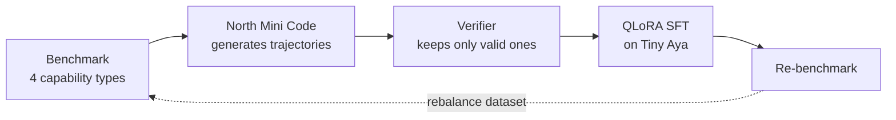

# aya-act

**Teaching multi-step agentic reasoning to a small on-device model by distilling verified tool-use trajectories from a stronger teacher.**

`aya-act` takes [`CohereLabs/tiny-aya-global`](https://huggingface.co/CohereLabs/tiny-aya-global) — a small, multilingual model built to run on-device — and teaches it to plan multi-step tool use: chaining one call's result into the next, refusing tasks no tool can satisfy, and branching on runtime values. The signal comes from a stronger teacher (Cohere's **North Mini Code**) whose outputs are filtered through a strict automatic verifier before they ever become training data, so the model only ever learns trajectories that provably satisfy the task.

---

## The gap

Out of the box, Tiny Aya does **single-turn function calling perfectly** — given a request that maps to one tool, it picks the right tool and fills the arguments. It breaks down the moment a task needs more than one step:

- **No data chaining.** Asked "what is the balance of the customer named John Smith?", it calls `get_balance` with `account_id: "John Smith"` — dropping the raw name where the *returned id of a previous lookup* belongs. It does not model that `find_customer` must run first and that its result feeds the next call.
- **No refusal.** When no available tool can satisfy the request ("convert 500 USD to euros"), it fabricates a plausible-looking plan instead of declining.
- **No branching.** Given "if the balance is over 1000, transfer 500; otherwise notify the customer", it collapses the two branches into one linear sequence, or executes both.

This is **not a language problem.** The failures reproduce identically on English prompts, so the gap is in multi-step *reasoning over tool results*, not in cross-lingual understanding.

---

## Method

A four-capability benchmark with strict automatic verification drives a distillation loop:



1. **Benchmark.** Hand-written scenarios, each labelled with one of four capability types:
   - `one_shot` — a single call, no dependencies.
   - `data_chain` — an argument references an earlier result via `"$N.field"` (the `field` of step *N*'s result, 1-based).
   - `rejection` — no available tool fits; the only correct answer is `{"error": "no tool available"}`.
   - `conditional` — the request branches (`if X then A else B`); the ground truth encodes every branch with its condition.
2. **Teacher generation.** North Mini Code is sampled up to *k* times per scenario.
3. **Verification filter.** Each sample is checked by the verifier; the first that passes is kept, the rest discarded. Scenarios where no sample passes are logged for review, never guessed.
4. **Supervised fine-tuning.** The verified trajectories are converted to a chat fine-tuning set and used for QLoRA SFT on Tiny Aya.
5. **Re-benchmark** the trained adapter, read the per-type breakdown, and rebalance the dataset for the next round.

The verifier is **tolerant in parsing** (it extracts JSON from prose, code fences, or multiple objects) but **strict in logic**: it checks call order, that references resolve to a real earlier step (and are not raw values or dangling), that argument values *and their JSON types* match the tool schema, that rejections are exact, and that every conditional branch is present. A plan that adds extra read-only steps is accepted as a benign superset; an extra call to a side-effecting tool (a stray `transfer`, an unrequested `notify`) is fatal.

---

## Results

Scored automatically by the verifier on the benchmark (20-scenario evaluation):

| Model | Total | `one_shot` | `data_chain` | `rejection` | `conditional` |
|---|:---:|:---:|:---:|:---:|:---:|
| **Tiny Aya (base)** | 5 / 20 | 5/5 | 0/5 | 0/5 | 0/5 |
| **+ SFT v1** — 20 examples, 25% rejection | 13 / 20 | 5/5 | 4/5 | 4/5 | 0/5 |
| **+ SFT v2** — 80 examples, 12.5% rejection | 15 / 20 | 5/5 | 5/5 | 1/5 | 4/5 |

From base to v2, `data_chain` goes 0→5 and `conditional` goes 0→4: the model learns to resolve `"$N.field"` references and to emit both branches of a condition — capabilities entirely absent in the base model.

---

## Key finding: refusal behaviour is highly sensitive to dataset proportion

The two training runs expose a clean, reproducible effect. **Refusal is not learned as a fixed skill — it is tuned by how much of the training set consists of rejection examples.**

- **v1 — rejection at 25% of the data → the model over-refuses.** It generalizes "when in doubt, decline" too aggressively and answers `{"error": "no tool available"}` on *conditional* scenarios that are perfectly solvable, scoring `conditional 0/5`.
- **v2 — rejection at 12.5% → the model under-refuses.** With refusal now under-represented, it swings the other way and builds plans for impossible requests instead of declining, dropping to `rejection 1/5` even as `conditional` recovers to `4/5`.

Both runs overshoot, in opposite directions. The proportion that produced correct refusal *and* correct branching lies between 12.5% and 25% — the two runs bracket it. The practical takeaway: for a small model, **the decision to act versus decline is shaped more by dataset composition than by any single example**, and it must be tuned as a ratio, not just taught.

---

## Repository structure

| File | Role |
|---|---|
| `tools.py` | The tool pool: ~10 enterprise tools with parameter/return schemas and a `side_effect` flag per tool. |
| `scenarios.py` | Hand-written benchmark scenarios (80 core, English), plus slots for cross-lingual validation sets. |
| `verifier.py` | The automatic verifier: tolerant JSON extraction, strict checks on order, references, argument values and types, rejection, and branches. |
| `runner.py` | Benchmark harness — runs every scenario through a model, prints a per-type table, writes a CSV. Ships with a dummy model and a provider CLI. |
| `teacher_generate.py` | Teacher-mode data generator: sample the teacher up to *k* times per scenario, keep the first verifier-approved completion, log the rest. |
| `prepare_dataset.py` | Convert the verified dataset into a chat fine-tuning JSONL. |
| `train.py` | QLoRA SFT script for Tiny Aya, training on the project's JSON action protocol. |
| `local_model.py` | Adapter to benchmark a trained LoRA checkpoint end-to-end. |
| `ollama_model.py`, `cohere_model.py` | Model adapters — the base model via a local Ollama server, the teacher via the Cohere Chat API. |
| `tests/` | Verifier unit tests, one per failure mode. |

---

## Reproducibility

Requirements: Python 3 (standard library only for the benchmark and data pipeline). Training needs a CUDA GPU; the SFT run fits on **a single 24 GB GPU** with 4-bit QLoRA.

```bash
# 1. Run the benchmark against the base model (served locally via Ollama)
python runner.py --provider ollama \
    --model hf.co/CohereLabs/tiny-aya-global-GGUF:Q4_K_M \
    --csv baseline_base.csv

# 2. Generate verified trajectories with the teacher (needs COHERE_API_KEY in the env)
python teacher_generate.py --provider cohere --model north-mini-code-1-0 \
    --k 4 --out teacher_core_80.jsonl

# 3. Convert the verified set into a chat fine-tuning JSONL
python prepare_dataset.py --in teacher_core_80.jsonl --out train_80.jsonl

# 4. Fine-tune Tiny Aya with QLoRA (single 24 GB GPU)
pip install "trl[peft]" bitsandbytes transformers datasets accelerate
python train.py

# 5. Re-benchmark the trained adapter
python runner.py --provider local --adapter tiny-aya-agent-v2 \
    --csv baseline_agent_v2.csv

# Verifier tests
python -m unittest discover -s tests
```

The Cohere adapter reads its key from the `COHERE_API_KEY` environment variable; **no credentials are stored in this repository.**

### Training data format

`train_*.jsonl` uses the Cohere chat fine-tuning shape — one conversation per line, prompt masked so loss is computed on the action only:

```json
{"messages": [{"role": "User", "content": "<tools + protocol + request>"}, {"role": "Chatbot", "content": "<verified JSON plan>"}]}
```

The action protocol is JSON throughout — an array of `{"tool", "args"}` calls, a `{"setup", "branches"}` object for conditionals, or `{"error": "no tool available"}` — the same shape the benchmark and verifier measure, so the training target and the evaluation are identical end to end.

---

## Limitations & next steps

- The results above bracket the optimal rejection proportion but do not pin it; the next round targets a ratio between 12.5% and 25%.
- Deep chains (3–4 steps) mostly run through the `find_customer → get_account → get_balance/transfer` spine, since that is the tool subgraph with genuinely chainable numeric fields. Broadening structural diversity means adding tools that return new chainable fields.
- Cross-lingual validation sets (Spanish, Portuguese, Hindi) are scaffolded in `scenarios.py` but not yet populated; the core benchmark is English.
